# Hi there, I'm Uttam Vaghasia! 👋

<div align="center">
  
</div>

<div align="center">
  
  
</div>

---

## 🚀 About Me

```typescript
const uttam = {
    location: "Surat, Gujarat, India 🇮🇳",
    role: "Full Stack Web/App Developer",
    passions: ["Web Development", "Mobile Apps", "AI/ML", "Open Source"],
    currentFocus: "Building scalable applications with Python & Flutter",
    funFact: "I debug with print() and I'm not ashamed! 😄",
    motto: "Code, Learn, Repeat 🔄"
};
```

## 📊 GitHub Analytics

<div align="center">
  
  
</div>

<div align="center">
  
</div>

<div align="center">
  
</div>

<div align="center">
  
</div>

<!-- Metrics -->
## 🧠 GitHub Metrics

<picture>
  
</picture>

## ⚡ Tech Stack

### Languages
<div align="center">
  
</div>

### Frameworks & Libraries
<div align="center">
  
</div>

### Tools & Platforms
<div align="center">
  
</div>

## 📈 Coding Activity

<!--START_SECTION:waka-->


**🐱 My GitHub Data** 

> 📦 1.2 MB Used in GitHub's Storage 
 > 
> 🏆 679 Contributions in the Year 2026
 > 
> 🚫 Not Opted to Hire
 > 
> 📜 18 Public Repositories 
 > 
> 🔑 12 Private Repositories 
 > 
**I'm an Early 🐤** 

```text
🌞 Morning                451 commits         █████░░░░░░░░░░░░░░░░░░░░   18.89 % 
🌆 Daytime                985 commits         ██████████░░░░░░░░░░░░░░░   41.27 % 
🌃 Evening                662 commits         ███████░░░░░░░░░░░░░░░░░░   27.73 % 
🌙 Night                  289 commits         ███░░░░░░░░░░░░░░░░░░░░░░   12.11 % 
```
📅 **I'm Most Productive on Tuesday** 

```text
Monday                   289 commits         ███░░░░░░░░░░░░░░░░░░░░░░   12.11 % 
Tuesday                  604 commits         ██████░░░░░░░░░░░░░░░░░░░   25.30 % 
Wednesday                244 commits         ███░░░░░░░░░░░░░░░░░░░░░░   10.22 % 
Thursday                 293 commits         ███░░░░░░░░░░░░░░░░░░░░░░   12.27 % 
Friday                   248 commits         ███░░░░░░░░░░░░░░░░░░░░░░   10.39 % 
Saturday                 330 commits         ███░░░░░░░░░░░░░░░░░░░░░░   13.82 % 
Sunday                   379 commits         ████░░░░░░░░░░░░░░░░░░░░░   15.88 % 
```


📊 **This Week I Spent My Time On** 

```text
🕑︎ Time Zone: Asia/Kolkata

💬 Programming Languages: 
JavaScript               1 hr 54 mins        █████████████░░░░░░░░░░░░   53.88 % 
Markdown                 1 hr 12 mins        █████████░░░░░░░░░░░░░░░░   34.06 % 
TypeScript               12 mins             ██░░░░░░░░░░░░░░░░░░░░░░░   06.03 % 
YAML                     6 mins              █░░░░░░░░░░░░░░░░░░░░░░░░   03.22 % 
XML                      4 mins              █░░░░░░░░░░░░░░░░░░░░░░░░   02.23 % 

🔥 Editors: 
Claude Code              3 hrs 31 mins       █████████████████████████   99.30 % 
Cursor                   1 min               ░░░░░░░░░░░░░░░░░░░░░░░░░   00.70 % 

🐱‍💻 Projects: 
portfolio                2 hrs 21 mins       █████████████████░░░░░░░░   66.49 % 
ag-view-360              50 mins             ██████░░░░░░░░░░░░░░░░░░░   23.81 % 
finance-tracker          18 mins             ██░░░░░░░░░░░░░░░░░░░░░░░   08.54 % 
nudge-systems            1 min               ░░░░░░░░░░░░░░░░░░░░░░░░░   00.77 % 
thediviinenumbers        0 secs              ░░░░░░░░░░░░░░░░░░░░░░░░░   00.40 % 

💻 Operating System: 
Windows                  3 hrs 32 mins       █████████████████████████   100.00 % 
```

**I Mostly Code in Dart** 

```text
TypeScript               6 repos             ████░░░░░░░░░░░░░░░░░░░░░   17.14 % 
Jupyter Notebook         2 repos             █░░░░░░░░░░░░░░░░░░░░░░░░   05.71 % 
JavaScript               2 repos             █░░░░░░░░░░░░░░░░░░░░░░░░   05.71 % 
TeX                      1 repo              █░░░░░░░░░░░░░░░░░░░░░░░░   02.86 % 
PHP                      1 repo              █░░░░░░░░░░░░░░░░░░░░░░░░   02.86 % 
```


**Timeline**


 Last Updated on 03/07/2026 13:46:47 UTC
<!--END_SECTION:waka-->

## 🎯 Current Goals

- 🔭 Working on **Many problems simultaneously**
- 🌱 Learning **Any topic I encounter in my day-to-day life in one night**
- 👯 Looking to collaborate on **Open Source Projects**
- 💬 Ask me about **Python, Flutter, or anything tech-related - 69% of the time I will be wrong.**
- ⚡ Fun fact: **I think debugging is like being a detective in a crime movie where you're also the murderer**

## 📱 Connect With Me

<div align="center">
  <a href="https://www.linkedin.com/in/uttam-vaghasia/" target="_blank">
    
  </a>
  <a href="mailto:the.uttam.vaghasia@gmail.com" target="_blank">
    
  </a>
  <a href="https://www.instagram.com/uttam.0410/" target="_blank">
    
  </a>
  <a href="https://discordapp.com/users/uv0410" target="_blank">
    
  </a>
  <a href="https://wa.link/9na6em" target="_blank">
    
  </a>
</div>

## 💡
<div align="center">
  
</div>

## 🐍 Contribution Snake
<div align="center">
  
</div>

## ☕ Support My Work

If you find my projects helpful and would like to support my open-source efforts, you can buy me a coffee here:

<div align="left">
  <a href="https://paypal.me/theUttamVaghasia" target="_blank">
    
  </a>
</div>

---

<div align="center">
  
</div>
